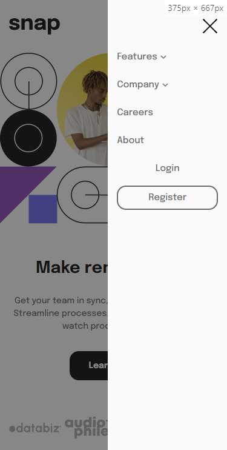
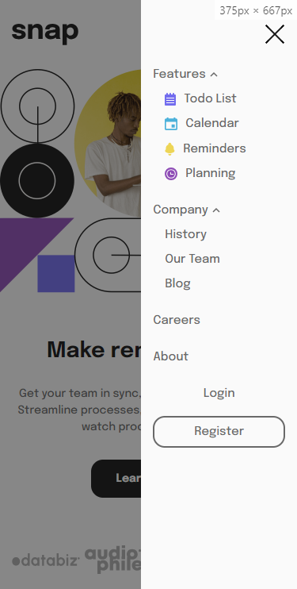

# Frontend Mentor - Intro section with dropdown navigation solution

This is a solution to the [Intro section with dropdown navigation challenge on Frontend Mentor](https://www.frontendmentor.io/challenges/intro-section-with-dropdown-navigation-ryaPetHE5). Frontend Mentor challenges help you improve your coding skills by building realistic projects.

## Table of contents

- [The challenge](#the-challenge)
- [Desired design](#desired-design)
- [My solution](#my-solution)
- [Screenshots](#screenshots)
  - [1440 x 839](#1440-x-839)
  - [375 x 667](#375-x-667)

## The challenge

Users should be able to:

- View the relevant dropdown menus on desktop and mobile when interacting with the navigation links
- View the optimal layout for the content depending on their device's screen size
- See hover states for all interactive elements on the page

## Desired design

## My solution

Technologies used: HTML, CSS and JavaScript.

Files can be found in **website** directory.

## Screenshots

### 1440 x 839

### 375 x 667

