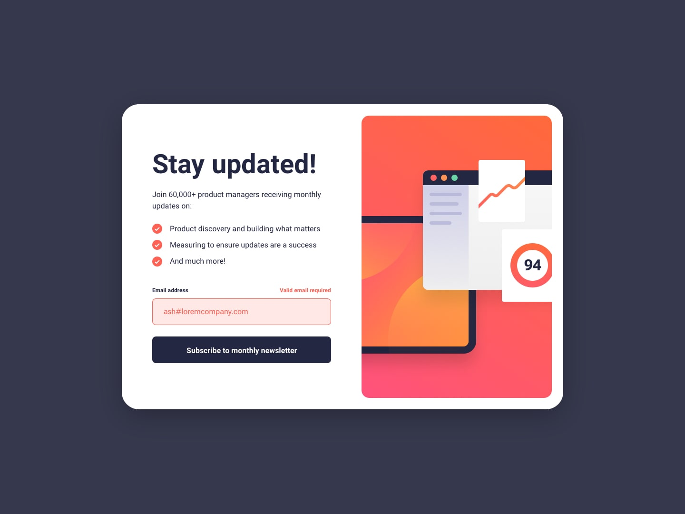

# Frontend Mentor - Newsletter sign-up form with success message solution

This is a solution to the [Newsletter sign-up form with success message challenge on Frontend Mentor](https://www.frontendmentor.io/challenges/newsletter-signup-form-with-success-message-3FC1AZbNrv). Frontend Mentor challenges help you improve your coding skills by building realistic projects.

## Table of contents

- [The challenge](#the-challenge)
- [Desired design](#desired-design)
- [My solution](#my-solution)
- [Screenshots](#screenshots)
  - [1920 x 1080](#1920-x-1080)
  - [1280 x 720](#1280-x-720)
  - [375 x 750](#375-x-750)

## The challenge

Users should be able to:

- Add their email and submit the form
- See a success message with their email after successfully submitting the form
- See form validation messages if:
  - The field is left empty
  - The email address is not formatted correctly
- View the optimal layout for the interface depending on their device's screen size
- See hover and focus states for all interactive elements on the page

## Desired design

## My solution

Technologies used: HTML, CSS and JavaScript.

Files can be found in **website** directory.

## Screenshots

### 1920 x 1080

### 1280 x 720

### 375 x 750
