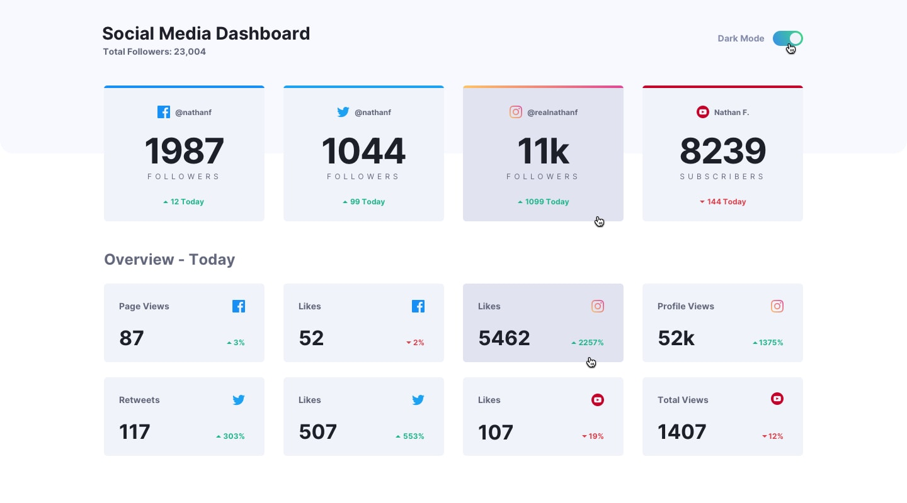
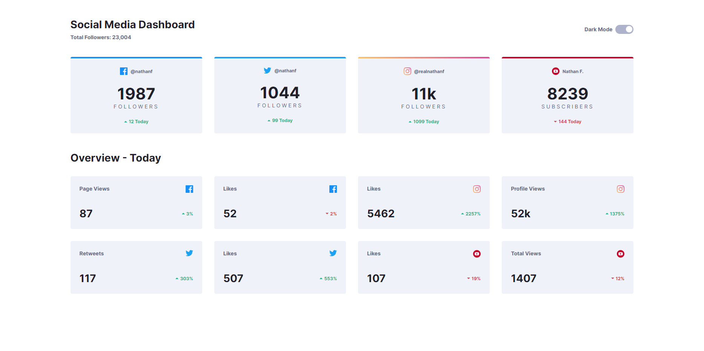
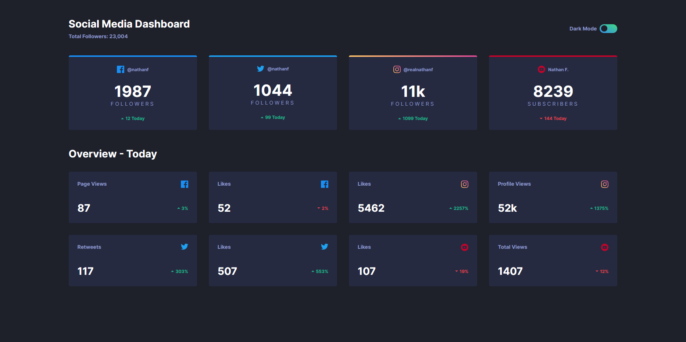
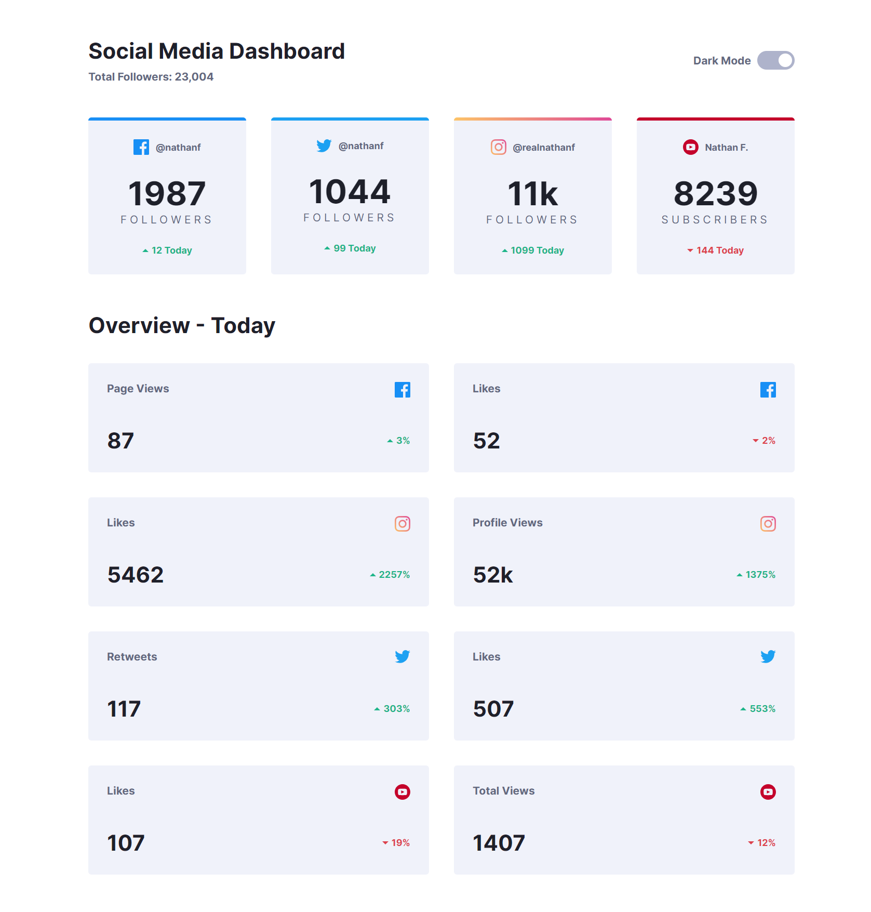
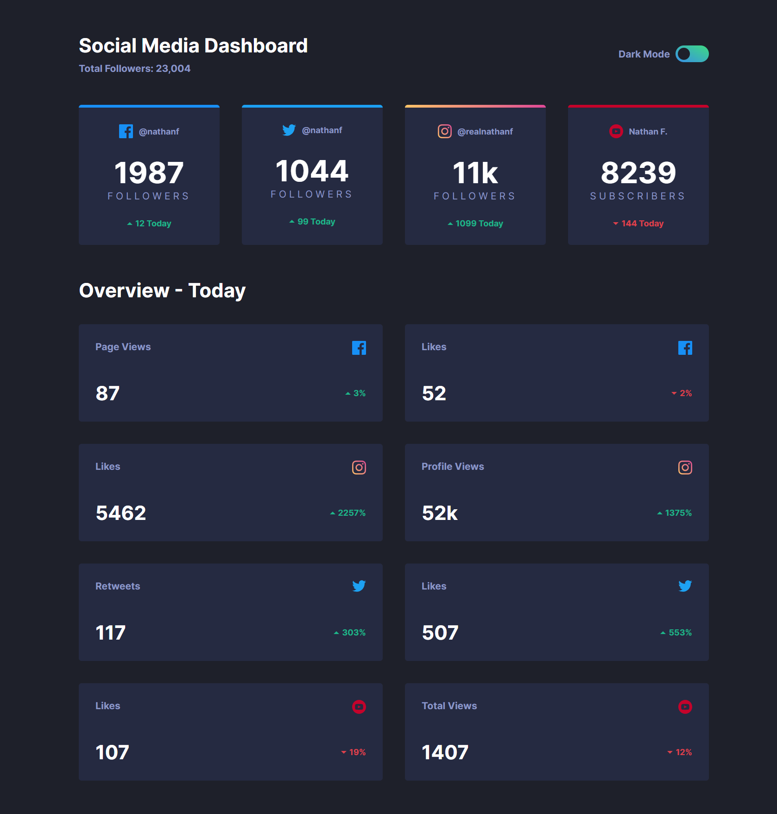
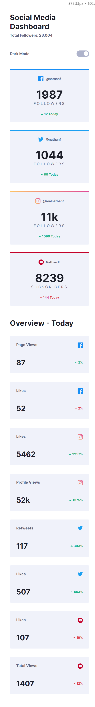
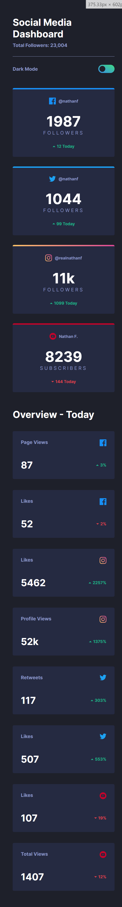

# Frontend Mentor - Social media dashboard with theme switcher solution

This is a solution to the [Social media dashboard with theme switcher challenge on Frontend Mentor](https://www.frontendmentor.io/challenges/social-media-dashboard-with-theme-switcher-6oY8ozp_H). Frontend Mentor challenges help you improve your coding skills by building realistic projects.

## Table of contents

- [The challenge](#the-challenge)
- [Desired design](#desired-design)
- [My solution](#my-solution)
- [Solution URL](#solution-url)
- [Screenshots](#screenshots)
  - [1920 x 1080](#screen-width-1920px)
  - [1280 x 720](#screen-width-1280px)
  - [375 x 667](#screen-width-375px)

## The challenge

Users should be able to:

- View the optimal layout for the site depending on their device's screen size
- See hover states for all interactive elements on the page
- Toggle color theme to their preference

## Desired design

## My solution

Technologies used: HTML, CSS and JavaScript.

Files can be found in **website** directory.

## Solution URL

[https://social-media-dashboard-radu-sofron.netlify.app/website/](https://social-media-dashboard-radu-sofron.netlify.app/website/)

## Screenshots

### Screen width: 1920px

### Screen width: 1280px

### Screen width: 375px

