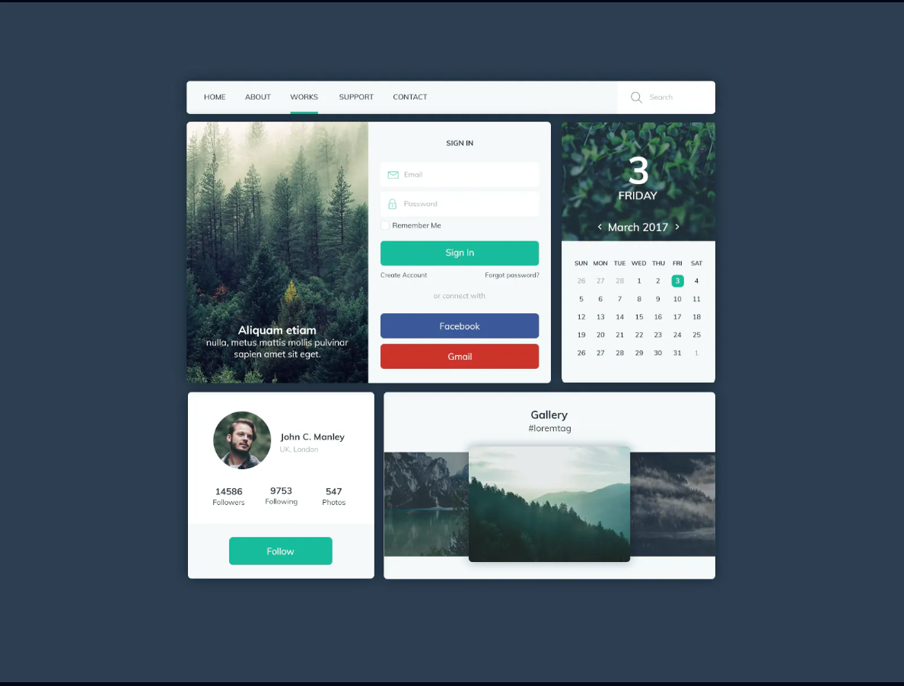

# iCodeThis

- offers a front-end challenge per day, typically with low complexity.

- does not provide designs for different screen sizes.

- iCodeThis does not provide access to the design files for the most accurate implementations.

## Folder structure

Every subfolder contains the solution to a challenge. Subfolder names correspond to the day when the challenge was published.

## Challenges

#### 1. Aug_Day24

- name: UI Kit
- technologies used: `HTML, CSS`
- challenge:

  

#### 2. Aug_Day26

- name: Check In
- technologies used: `HTML, CSS`
- challenge:

  

#### 3. Aug_Day28

- name: Mobile Movie Ad
- technologies used: `HTML, CSS`
- challenge:

  

#### 4. Aug_Day29

- name: Playlist
- technologies used: `HTML, CSS`
- challenge:

  

#### 5. Aug_Day30

- name: Purple Messages
- technologies used: `HTML, CSS`
- challenge:

  

#### 6. Aug_Day31

- name: Select Interest
- technologies used: `HTML, CSS, JavaScript`
- challenge:

  

#### 7. Sep_Day1

- name: Social Ui Kit
- technologies used: `HTML, CSS`
- challenge:

  

#### 8. Sep_Day3

- name: Notifications 3
- technologies used: `HTML, CSS`
- challenge:

  

#### 9. Sep_Day4

- name: Reviews 3
- technologies used: `HTML, CSS`
- challenge:

  

#### 10. Sep_Day5

- name: Testimonials 3
- technologies used: `HTML, CSS, JavaScript`
- challenge:

  

#### 11. Sep_Day10

- name: Main Image
- technologies used: `HTML, CSS`
- challenge:

  
