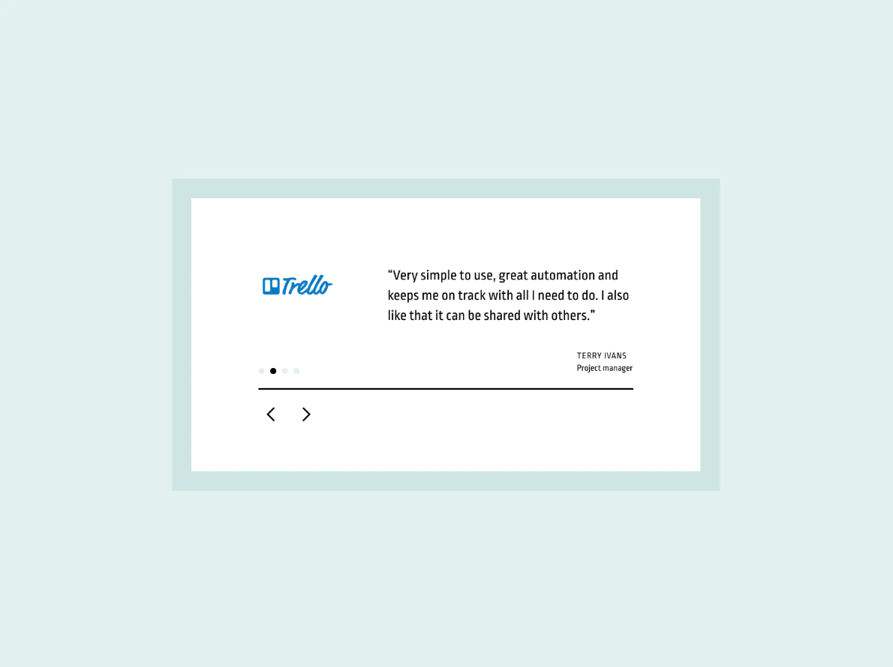

# Challenge: Testimonials 3

### The challenge

### My solution

In addition to HTML and CSS, I have used JavaScript to allow users to change the app and its testimonials using the arrows.

`Resolution: 1280 x 720`

